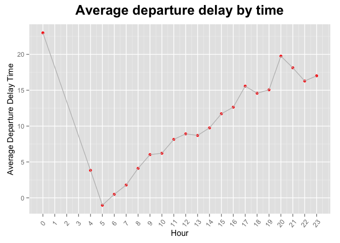
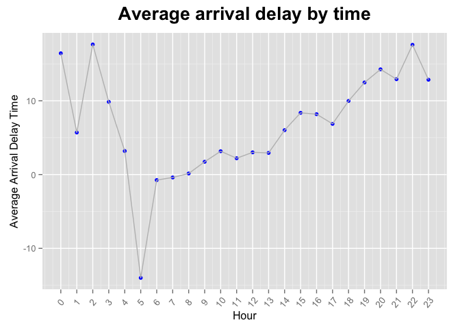
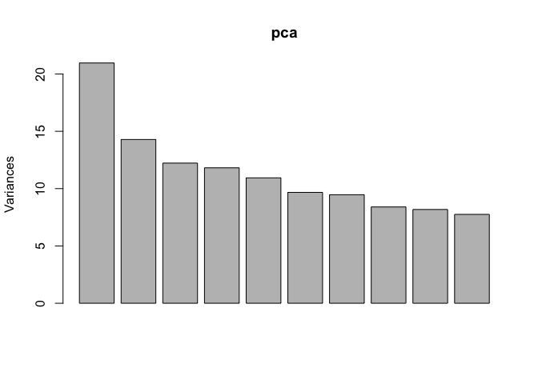

# Assignment2_WenyueShi
Wenyue Shi  
August 15, 2015  

# Problem 1: Airplane Delay
Load the library and read in the data. Source multiplot function


```r
library(mosaic)
```

```
## Loading required package: car
## Loading required package: dplyr
## 
## Attaching package: 'dplyr'
## 
## The following objects are masked from 'package:stats':
## 
##     filter, lag
## 
## The following objects are masked from 'package:base':
## 
##     intersect, setdiff, setequal, union
## 
## Loading required package: lattice
## Loading required package: ggplot2
## Loading required package: mosaicData
## 
## Attaching package: 'mosaic'
## 
## The following objects are masked from 'package:dplyr':
## 
##     count, do, tally
## 
## The following object is masked from 'package:car':
## 
##     logit
## 
## The following objects are masked from 'package:stats':
## 
##     binom.test, cor, cov, D, fivenum, IQR, median, prop.test,
##     quantile, sd, t.test, var
## 
## The following objects are masked from 'package:base':
## 
##     max, mean, min, prod, range, sample, sum
```

```r
library(ggplot2)
plane = read.csv('../data/ABIA.csv')
```

Summary the data. 


```r
summary(plane)
```

```
##       Year          Month         DayofMonth      DayOfWeek    
##  Min.   :2008   Min.   : 1.00   Min.   : 1.00   Min.   :1.000  
##  1st Qu.:2008   1st Qu.: 3.00   1st Qu.: 8.00   1st Qu.:2.000  
##  Median :2008   Median : 6.00   Median :16.00   Median :4.000  
##  Mean   :2008   Mean   : 6.29   Mean   :15.73   Mean   :3.902  
##  3rd Qu.:2008   3rd Qu.: 9.00   3rd Qu.:23.00   3rd Qu.:6.000  
##  Max.   :2008   Max.   :12.00   Max.   :31.00   Max.   :7.000  
##                                                                
##     DepTime       CRSDepTime      ArrTime       CRSArrTime  
##  Min.   :   1   Min.   :  55   Min.   :   1   Min.   :   5  
##  1st Qu.: 917   1st Qu.: 915   1st Qu.:1107   1st Qu.:1115  
##  Median :1329   Median :1320   Median :1531   Median :1535  
##  Mean   :1329   Mean   :1320   Mean   :1487   Mean   :1505  
##  3rd Qu.:1728   3rd Qu.:1720   3rd Qu.:1903   3rd Qu.:1902  
##  Max.   :2400   Max.   :2346   Max.   :2400   Max.   :2400  
##  NA's   :1413                  NA's   :1567                 
##  UniqueCarrier     FlightNum       TailNum      ActualElapsedTime
##  WN     :34876   Min.   :   1          : 1104   Min.   : 22.0    
##  AA     :19995   1st Qu.: 640   N678CA :  195   1st Qu.: 57.0    
##  CO     : 9230   Median :1465   N511SW :  180   Median :125.0    
##  YV     : 4994   Mean   :1917   N526SW :  176   Mean   :120.2    
##  B6     : 4798   3rd Qu.:2653   N528SW :  172   3rd Qu.:164.0    
##  XE     : 4618   Max.   :9741   N520SW :  168   Max.   :506.0    
##  (Other):20749                  (Other):97265   NA's   :1601     
##  CRSElapsedTime     AirTime          ArrDelay           DepDelay      
##  Min.   : 17.0   Min.   :  3.00   Min.   :-129.000   Min.   :-42.000  
##  1st Qu.: 58.0   1st Qu.: 38.00   1st Qu.:  -9.000   1st Qu.: -4.000  
##  Median :130.0   Median :105.00   Median :  -2.000   Median :  0.000  
##  Mean   :122.1   Mean   : 99.81   Mean   :   7.065   Mean   :  9.171  
##  3rd Qu.:165.0   3rd Qu.:142.00   3rd Qu.:  10.000   3rd Qu.:  8.000  
##  Max.   :320.0   Max.   :402.00   Max.   : 948.000   Max.   :875.000  
##  NA's   :11      NA's   :1601     NA's   :1601       NA's   :1413     
##      Origin           Dest          Distance        TaxiIn       
##  AUS    :49623   AUS    :49637   Min.   :  66   Min.   :  0.000  
##  DAL    : 5583   DAL    : 5573   1st Qu.: 190   1st Qu.:  4.000  
##  DFW    : 5508   DFW    : 5506   Median : 775   Median :  5.000  
##  IAH    : 3704   IAH    : 3691   Mean   : 705   Mean   :  6.413  
##  PHX    : 2786   PHX    : 2783   3rd Qu.:1085   3rd Qu.:  7.000  
##  DEN    : 2719   DEN    : 2673   Max.   :1770   Max.   :143.000  
##  (Other):29337   (Other):29397                  NA's   :1567     
##     TaxiOut         Cancelled       CancellationCode    Diverted       
##  Min.   :  1.00   Min.   :0.00000    :97840          Min.   :0.000000  
##  1st Qu.:  9.00   1st Qu.:0.00000   A:  719          1st Qu.:0.000000  
##  Median : 12.00   Median :0.00000   B:  605          Median :0.000000  
##  Mean   : 13.96   Mean   :0.01431   C:   96          Mean   :0.001824  
##  3rd Qu.: 16.00   3rd Qu.:0.00000                    3rd Qu.:0.000000  
##  Max.   :305.00   Max.   :1.00000                    Max.   :1.000000  
##  NA's   :1419                                                          
##   CarrierDelay     WeatherDelay       NASDelay      SecurityDelay   
##  Min.   :  0.00   Min.   :  0.00   Min.   :  0.00   Min.   :  0.00  
##  1st Qu.:  0.00   1st Qu.:  0.00   1st Qu.:  0.00   1st Qu.:  0.00  
##  Median :  0.00   Median :  0.00   Median :  2.00   Median :  0.00  
##  Mean   : 15.39   Mean   :  2.24   Mean   : 12.47   Mean   :  0.07  
##  3rd Qu.: 16.00   3rd Qu.:  0.00   3rd Qu.: 16.00   3rd Qu.:  0.00  
##  Max.   :875.00   Max.   :412.00   Max.   :367.00   Max.   :199.00  
##  NA's   :79513    NA's   :79513    NA's   :79513    NA's   :79513   
##  LateAircraftDelay
##  Min.   :  0.00   
##  1st Qu.:  0.00   
##  Median :  6.00   
##  Mean   : 22.97   
##  3rd Qu.: 30.00   
##  Max.   :458.00   
##  NA's   :79513
```

Notice many features should be factors but they are treated as numeric. Change them to factors.


```r
plane$Year = as.factor(plane$Year)
plane$Month = as.factor(plane$Month)
plane$DayofMonth = as.factor(plane$DayofMonth)
plane$DayOfWeek = as.factor(plane$DayOfWeek)
plane$Cancelled = as.factor(plane$Cancelled)
plane$CancellationCode = as.factor(plane$CancellationCode)
plane$UniqueCarrier = as.factor(plane$UniqueCarrier)
summary(plane)
```

```
##    Year           Month         DayofMonth    DayOfWeek    DepTime    
##  2008:99260   6      : 9090   18     : 3346   1:14798   Min.   :   1  
##               5      : 9021   21     : 3336   2:14803   1st Qu.: 917  
##               7      : 8931   11     : 3334   3:14841   Median :1329  
##               3      : 8921   14     : 3333   4:14774   Mean   :1329  
##               1      : 8726   10     : 3318   5:14768   3rd Qu.:1728  
##               8      : 8553   7      : 3315   6:11454   Max.   :2400  
##               (Other):46018   (Other):79278   7:13822   NA's   :1413  
##    CRSDepTime      ArrTime       CRSArrTime   UniqueCarrier  
##  Min.   :  55   Min.   :   1   Min.   :   5   WN     :34876  
##  1st Qu.: 915   1st Qu.:1107   1st Qu.:1115   AA     :19995  
##  Median :1320   Median :1531   Median :1535   CO     : 9230  
##  Mean   :1320   Mean   :1487   Mean   :1505   YV     : 4994  
##  3rd Qu.:1720   3rd Qu.:1903   3rd Qu.:1902   B6     : 4798  
##  Max.   :2346   Max.   :2400   Max.   :2400   XE     : 4618  
##                 NA's   :1567                  (Other):20749  
##    FlightNum       TailNum      ActualElapsedTime CRSElapsedTime 
##  Min.   :   1          : 1104   Min.   : 22.0     Min.   : 17.0  
##  1st Qu.: 640   N678CA :  195   1st Qu.: 57.0     1st Qu.: 58.0  
##  Median :1465   N511SW :  180   Median :125.0     Median :130.0  
##  Mean   :1917   N526SW :  176   Mean   :120.2     Mean   :122.1  
##  3rd Qu.:2653   N528SW :  172   3rd Qu.:164.0     3rd Qu.:165.0  
##  Max.   :9741   N520SW :  168   Max.   :506.0     Max.   :320.0  
##                 (Other):97265   NA's   :1601      NA's   :11     
##     AirTime          ArrDelay           DepDelay           Origin     
##  Min.   :  3.00   Min.   :-129.000   Min.   :-42.000   AUS    :49623  
##  1st Qu.: 38.00   1st Qu.:  -9.000   1st Qu.: -4.000   DAL    : 5583  
##  Median :105.00   Median :  -2.000   Median :  0.000   DFW    : 5508  
##  Mean   : 99.81   Mean   :   7.065   Mean   :  9.171   IAH    : 3704  
##  3rd Qu.:142.00   3rd Qu.:  10.000   3rd Qu.:  8.000   PHX    : 2786  
##  Max.   :402.00   Max.   : 948.000   Max.   :875.000   DEN    : 2719  
##  NA's   :1601     NA's   :1601       NA's   :1413      (Other):29337  
##       Dest          Distance        TaxiIn           TaxiOut      
##  AUS    :49637   Min.   :  66   Min.   :  0.000   Min.   :  1.00  
##  DAL    : 5573   1st Qu.: 190   1st Qu.:  4.000   1st Qu.:  9.00  
##  DFW    : 5506   Median : 775   Median :  5.000   Median : 12.00  
##  IAH    : 3691   Mean   : 705   Mean   :  6.413   Mean   : 13.96  
##  PHX    : 2783   3rd Qu.:1085   3rd Qu.:  7.000   3rd Qu.: 16.00  
##  DEN    : 2673   Max.   :1770   Max.   :143.000   Max.   :305.00  
##  (Other):29397                  NA's   :1567      NA's   :1419    
##  Cancelled CancellationCode    Diverted         CarrierDelay   
##  0:97840    :97840          Min.   :0.000000   Min.   :  0.00  
##  1: 1420   A:  719          1st Qu.:0.000000   1st Qu.:  0.00  
##            B:  605          Median :0.000000   Median :  0.00  
##            C:   96          Mean   :0.001824   Mean   : 15.39  
##                             3rd Qu.:0.000000   3rd Qu.: 16.00  
##                             Max.   :1.000000   Max.   :875.00  
##                                                NA's   :79513   
##   WeatherDelay       NASDelay      SecurityDelay    LateAircraftDelay
##  Min.   :  0.00   Min.   :  0.00   Min.   :  0.00   Min.   :  0.00   
##  1st Qu.:  0.00   1st Qu.:  0.00   1st Qu.:  0.00   1st Qu.:  0.00   
##  Median :  0.00   Median :  2.00   Median :  0.00   Median :  6.00   
##  Mean   :  2.24   Mean   : 12.47   Mean   :  0.07   Mean   : 22.97   
##  3rd Qu.:  0.00   3rd Qu.: 16.00   3rd Qu.:  0.00   3rd Qu.: 30.00   
##  Max.   :412.00   Max.   :367.00   Max.   :199.00   Max.   :458.00   
##  NA's   :79513    NA's   :79513    NA's   :79513    NA's   :79513
```

### Question to Answer: What's the best time of the day to fly to minimize delays?

Cut the scheduled arrival/departure time into 24 hours.


```r
sch_dep_time_cut = cut(plane$CRSDepTime, 24, labels = c('12-1', '1-2', '2-3', '3-4', '4-5', '5-6', '6-7', '7-8', '8-9', '9-10', '10-11', '11-12', '12-13', '13-14', '14-15', '15-16', '16-17', '17-18', '18-19', '19-20', '20-21', '21-22', '22-23', '23-24'))
sch_arr_time_cut = cut(plane$CRSArrTime, 24, labels = c('12-1', '1-2', '2-3', '3-4', '4-5', '5-6', '6-7', '7-8', '8-9', '9-10', '10-11', '11-12', '12-13', '13-14', '14-15', '15-16', '16-17', '17-18', '18-19', '19-20', '20-21', '21-22', '22-23', '23-24'))
```

Aggregate the departure delay by the scheduled departure time.


```r
# Aggregate by scheduled departure time
aggregate_sch_depdelay = aggregate(plane$DepDelay, by = list(sch_dep_time_cut), FUN = mean, na.rm = TRUE)
aggregate_sch_depdelay = as.data.frame(aggregate_sch_depdelay)
aggregate_sch_depdelay$Time = c(0, 4, 5, 6, 7, 8, 9, 10, 11, 12, 13, 14, 15, 16, 17, 18, 19, 20, 21, 22, 23)

g <- ggplot(aggregate_sch_depdelay, aes(Time, x))+geom_point(color="red")+geom_line(color = 'grey')
g <- g + scale_x_continuous(breaks=0:23)
g <- g+ggtitle('Average departure delay by time')
g <- g+theme(plot.title = element_text(size=20, face="bold", vjust=2))
g <- g+labs(x="Hour", y=expression(paste("Average Departure Delay Time")))
g <- g + theme(axis.text.x=element_text(angle=50, size=10, vjust=0.5))
g
```

 

Apparently, if you want to minimize the departure delay time, the best time to take off is 6 am.
Get average arrival delay time aggregated by the scheduled arrival time.


```r
aggregate_sch_arrdelay = aggregate(plane$ArrDelay, by = list(sch_arr_time_cut), FUN = mean, na.rm = TRUE)
aggregate_sch_arrdelay$Time = seq(0, 23)


addlinetoplot <- function(dataset, varx, vary) { 
  list(
    geom_line(data=dataset, aes_string(x=varx, y=vary)), 
    geom_point(data=dataset, aes_string(x=varx, y=vary))
  )
}
p <- ggplot(aggregate_sch_arrdelay, aes(Time, x))+geom_point(color="blue")+geom_line(color = 'grey')
p <- p + scale_x_continuous(breaks=0:23)
p <- p+ggtitle('Average arrival delay by time')
p <- p+theme(plot.title = element_text(size=20, face="bold", vjust=2))
p <- p+labs(x="Hour", y=expression(paste("Average Arrival Delay Time")))
p <- p + theme(axis.text.x=element_text(angle=50, size=10, vjust=0.5))
p
```

 

We can see a similar pattern here with the arrival delay time. 
Again, the best time to take plane is from 6 am to 8 am.

# Problem 2: Author Attribution
Load in the libraries.


```r
library(tm)
```

```
## Loading required package: NLP
## 
## Attaching package: 'NLP'
## 
## The following object is masked from 'package:ggplot2':
## 
##     annotate
```

```r
library(randomForest)
```

```
## randomForest 4.6-10
## Type rfNews() to see new features/changes/bug fixes.
## 
## Attaching package: 'randomForest'
## 
## The following object is masked from 'package:dplyr':
## 
##     combine
```

Source in the reader rapper function.


```r
readerPlain = function(fname){
  readPlain(elem=list(content=readLines(fname)), 
            id=fname, language='en') }
```

Rolling all train and test directories into a single corpus.


```r
author_train = Sys.glob('../data/ReutersC50/C50train/*')
author_test = Sys.glob('../data/ReutersC50/C50tests/*')
author_dirs = c(author_train, author_test)
```

Get the name of the files and the author names.


```r
file_list = NULL
labels = NULL
train_or_not = NULL
for(author in author_dirs) {
  author_name = substring(author, first=29)
  files_to_add = Sys.glob(paste0(author, '/*.txt'))
  file_list = append(file_list, files_to_add)
  labels = append(labels, rep(author_name, length(files_to_add)))
}
head(file_list)
```

```
## [1] "../data/ReutersC50/C50train/AaronPressman/106247newsML.txt"
## [2] "../data/ReutersC50/C50train/AaronPressman/120600newsML.txt"
## [3] "../data/ReutersC50/C50train/AaronPressman/120683newsML.txt"
## [4] "../data/ReutersC50/C50train/AaronPressman/136958newsML.txt"
## [5] "../data/ReutersC50/C50train/AaronPressman/137498newsML.txt"
## [6] "../data/ReutersC50/C50train/AaronPressman/14014newsML.txt"
```

```r
n = length(file_list)
labels_train = labels[1:(n/2)]
labels_test = labels[((n/2)+1):n]
authors = levels(as.factor(labels_train))
head(authors)
```

```
## [1] "AaronPressman"   "AlanCrosby"      "AlexanderSmith"  "BenjaminKangLim"
## [5] "BernardHickey"   "BradDorfman"
```

Read in the documents and rename each of them.


```r
all_docs = lapply(file_list, readerPlain) 
names(all_docs) = file_list
names(all_docs) = sub('.txt', '', names(all_docs))

my_corpus = Corpus(VectorSource(all_docs))
names(my_corpus) = file_list
```

Preprocess the corpus to remove all numbers, punctuations, excess white-space, and stop-words. Turn everything into lowercase.


```r
my_corpus = tm_map(my_corpus, content_transformer(tolower)) # make everything lowercase
my_corpus = tm_map(my_corpus, content_transformer(removeNumbers)) # remove numbers
my_corpus = tm_map(my_corpus, content_transformer(removePunctuation)) # remove punctuation
my_corpus = tm_map(my_corpus, content_transformer(stripWhitespace)) ## remove excess white-space
my_corpus = tm_map(my_corpus, content_transformer(removeWords), stopwords("SMART"))
```

Take a look at the summary of the Document Term Matrix of the corpus. Notice we have a really high sparcity. 


```r
DTM = DocumentTermMatrix(my_corpus)
DTM 
```

```
## <<DocumentTermMatrix (documents: 5000, terms: 44234)>>
## Non-/sparse entries: 858721/220311279
## Sparsity           : 100%
## Maximal term length: 45
## Weighting          : term frequency (tf)
```

Remove the terms that didn't show in 97.5% of all the documents. The sparcity got reduced to 93%.


```r
DTM = removeSparseTerms(DTM, 0.975)
DTM
```

```
## <<DocumentTermMatrix (documents: 5000, terms: 1386)>>
## Non-/sparse entries: 494509/6435491
## Sparsity           : 93%
## Maximal term length: 18
## Weighting          : term frequency (tf)
```

## Naive Bayes
Now fit the DTM to a naive bayes model. First, change the DTM to matrix form and seperate the train and test data sets.


```r
X = as.matrix(DTM)
train = X[1:(n/2), ]
test = X[((n/2)+1):n, ]
```

Get the w for each author, the rows being each words and the columns being each authors.


```r
i = 0
w = NULL
smooth_count = 1/50
for (author in authors) {
  cat(i)
  col = NULL
  train = X[((i*50)+1):((i*50)+50),]
  col = colSums(train + smooth_count)
  names(col) = colnames(train)
  temp = col/sum(col)
  w = cbind(w,temp)
  i = i+1
}
```

```
## 012345678910111213141516171819202122232425262728293031323334353637383940414243444546474849
```

```r
colnames(w) = authors
```

Fit the naive bayes model to the test dataset. The printed six line is the first 6 predicted author names.


```r
fit = matrix(nrow = 2500, ncol = 50)

for (i in seq(1:2500)) {
  for (j in seq(1, 50)) {
    fit[i, j] = sum(test[i, ] * log(w[, j]))
  }
}

colnames(fit) = authors
labels_fit = apply(fit, 1, which.max)
author_fit = authors[labels_fit]
head(author_fit)
```

```
## [1] "AaronPressman" "AaronPressman" "SamuelPerry"   "AaronPressman"
## [5] "AaronPressman" "AaronPressman"
```

Calculate the accuracy of the model.


```r
compare = cbind(author_fit, labels_test)
dim(compare)
```

```
## [1] 2500    2
```

```r
head(compare)
```

```
##      author_fit      labels_test    
## [1,] "AaronPressman" "AaronPressman"
## [2,] "AaronPressman" "AaronPressman"
## [3,] "SamuelPerry"   "AaronPressman"
## [4,] "AaronPressman" "AaronPressman"
## [5,] "AaronPressman" "AaronPressman"
## [6,] "AaronPressman" "AaronPressman"
```

```r
good_naive_bayes = 0
for (i in seq(1, dim(compare)[1])) {
  if (compare[i, 1] == compare[i, 2]) {
    good_naive_bayes = good_naive_bayes + 1
  }
}

accurate_rate = good_naive_bayes / (n/2)
accurate_rate
```

```
## [1] 0.5464
```

## Use PCA and random forest model
First, apply PCA to the scaled train data set. Plot the explained variance by each components.


```r
X = as.matrix(DTM)
train = X[1:2500, ]
test = X[2501:5000, ]

pca = prcomp(train, scale=TRUE)
plot(pca) 
```

 

Get the score from the test data set.


```r
test.p <- predict(pca, newdata = test)
```

Select the first 100 components for supervised random forest.


```r
train.new <- pca$x[, 1:100]
train.new = as.data.frame(train.new)
train.new$authors = as.factor(labels_train)
```

Fit the random forest model.


```r
rf_pca = randomForest(authors~., data = train.new, importance = TRUE, ntrees = 200, mtry = 10)
```

Predict the authors for the test data sets and calculate the accuracy.


```r
prediction_pca = predict(rf_pca, test.p, type = 'response')
good = 0
for (i in seq(1, (n/2))) {
  if (labels_test[i] == prediction_pca[i]) {
    good = good + 1
  }
}
good/(n/2)
```

```
## [1] 0.554
```

From the accuracy, we can see that there isn't much difference between the accuracy of the two model. However, considering that PCA reduce the number of features used, I will go with PCA and random forest.

## Topic Models and Random Forest
Topic Models is another way to reduce features and it can greatly reduce a large number of features to several topics. Let's see how well it works.

Select the K with topic model function.


```r
library(maptpx)
```

```
## Loading required package: slam
## 
## Attaching package: 'maptpx'
## 
## The following object is masked from 'package:mosaic':
## 
##     logit
## 
## The following object is masked from 'package:car':
## 
##     logit
```

```r
DTM_train = DTM[1:(n/2), ]
DTM_test = DTM[((n/2)+1):n, ]
tm_select = topics(DTM_train, K=c(10:30))
```

```
## 
## Estimating on a 2500 document collection.
## Fit and Bayes Factor Estimation for K = 10 ... 30
## log posterior increase: 6788.3, 3610.3, 1491.9, 822.9, 520.4, 333.8, 288.1, done.
## log BF( 10 ) = 194625.77
## log posterior increase: 4404.6, 182.7, done.
## log BF( 11 ) = 216274.6
## log posterior increase: 2954.6, 136.4, done.
## log BF( 12 ) = 224069.87
## log posterior increase: 2140.2, 284.8, 109.5, done.
## log BF( 13 ) = 228133.22
## log posterior increase: 2599, 145.1, done.
## log BF( 14 ) = 237057.47
## log posterior increase: 2216.2, 132.4, done.
## log BF( 15 ) = 240314.77
## log posterior increase: 1932, 136.2, 141, done.
## log BF( 16 ) = 235642.71
## log posterior increase: 1984.6, 131.8, 86.6, 82.1, done.
## log BF( 17 ) = 233581.43
```

```r
tm_select$K
```

```
## [1] 15
```

The best number of topics is 15.


```r
tm_selected = topics(DTM_train, K = 15)
```

```
## 
## Estimating on a 2500 document collection.
## Fitting the 15 topic model.
## log posterior increase: 10252.8, 4214.8, 2077.1, 1115.7, 659.6, 358.2, 321, 165.6, done.
```

```r
pred = predict.topics(tm_selected, DTM_test)
```

Preprocess the train dataset for random forest with omega.


```r
omega = tm_selected$omega
omega_frame = as.data.frame(omega)
omega_frame$authors = labels_train
omega_frame$authors = as.factor(omega_frame$authors)
names(omega_frame) = c('topic1', 
                       'topic2', 
                       'topic3', 
                       'topic4', 
                       'topic5', 
                       'topic6', 
                       'topic7', 
                       'topic8', 
                       'topic9', 
                       'topic10', 
                       'topic11', 
                       'topic12', 
                       'topic13', 
                       'topic14', 
                       'topic15', 
                       'authors')
```

Fit the topics to random forest and get the predictions.


```r
rf1 = randomForest(authors~., data = omega_frame, importance = TRUE, ntrees = 200, mtry = 3)
pred_frame = as.data.frame(pred)
names(pred_frame) = c('topic1', 
                      'topic2', 
                      'topic3', 
                      'topic4', 
                      'topic5', 
                      'topic6', 
                      'topic7', 
                      'topic8', 
                      'topic9', 
                      'topic10', 
                      'topic11', 
                      'topic12', 
                      'topic13', 
                      'topic14', 
                      'topic15')
prediction = predict(rf1, pred_frame, type = 'response')
good = 0
labels_test[1] == prediction[1]
```

```
## [1] FALSE
```

```r
prediction[1]
```

```
##              1 
## AlexanderSmith 
## 50 Levels: AaronPressman AlanCrosby AlexanderSmith ... WilliamKazer
```

```r
for (i in seq(1, (n/2))) {
  if (labels_test[i] == prediction[i]) {
    good = good + 1
  }
}
good
```

```
## [1] 980
```

```r
good/2500
```

```
## [1] 0.392
```

The accuracy is only near 40%, which is far worse than PCA and Random Forest. So in conclusion, we would choose PCA and random forest.

Lastly, let's take a look at how random forest perform on the all terms.


```r
library(caret)
```

```
## 
## Attaching package: 'caret'
## 
## The following object is masked from 'package:mosaic':
## 
##     dotPlot
```

```r
train = X[1:(n/2), ]
test = X[((n/2)+1):n, ]
rf_all = randomForest(x = train, y = as.factor(labels_train), ntrees = 200, mtry = 37)
prediction_rf = predict(rf_all, newdata = test)
confusion = confusionMatrix(prediction_rf, labels_test)
confusion$overall
```

```
##       Accuracy          Kappa  AccuracyLower  AccuracyUpper   AccuracyNull 
##      0.6260000      0.6183673      0.6066942      0.6450102      0.0200000 
## AccuracyPValue  McnemarPValue 
##      0.0000000            NaN
```

Clearly, random forest with the original features give out a better result. But the overall result is not good for all the models here. The reason is probably because I combine the test and train documents together at the beginning and did the word processing to them together. Treating them differently will probably give a better result.

We would like to know whether some authors are easier to predict while others are not. Let's see the accuracy for each authors with the PCA and random forest model which has the highest accuracy.


```r
pred_table = table(labels_test, prediction_pca)
pred_max = apply(pred_table, 1, max)
pred_prob = pred_max/50
pred_prob
```

```
##     AaronPressman        AlanCrosby    AlexanderSmith   BenjaminKangLim 
##              0.86              0.44              0.54              0.32 
##     BernardHickey       BradDorfman  DarrenSchuettler       DavidLawder 
##              0.44              0.64              0.60              0.54 
##     EdnaFernandes       EricAuchard    FumikoFujisaki    GrahamEarnshaw 
##              0.36              0.26              0.82              0.82 
##  HeatherScoffield     JaneMacartney        JanLopatka      JimGilchrist 
##              0.38              0.28              0.56              0.98 
##          JoeOrtiz      JohnMastrini      JonathanBirt    JoWinterbottom 
##              0.50              0.38              0.78              0.66 
##       KarlPenhaul         KeithWeir    KevinDrawbaugh     KevinMorrison 
##              0.80              0.76              0.60              0.40 
##     KirstinRidley KouroshKarimkhany         LydiaZajc    LynneO'Donnell 
##              0.64              0.72              0.62              0.76 
##   LynnleyBrowning   MarcelMichelson      MarkBendeich        MartinWolk 
##              0.92              0.70              0.54              0.30 
##      MatthewBunce     MichaelConnor        MureDickie         NickLouth 
##              0.86              0.68              0.30              0.66 
##   PatriciaCommins     PeterHumphrey        PierreTran        RobinSidel 
##              0.50              0.74              0.50              0.88 
##      RogerFillion       SamuelPerry      SarahDavison       ScottHillis 
##              0.72              0.54              0.42              0.26 
##       SimonCowell          TanEeLyn    TheresePoletti        TimFarrand 
##              0.38              0.38              0.58              0.76 
##        ToddNissen      WilliamKazer 
##              0.46              0.24
```

If the author has a accuracy queal to or greater than 0.6, we would say he is a predictable author. Let's take a look at the predictable ones.


```r
names(which(pred_prob >= 0.6))
```

```
##  [1] "AaronPressman"     "BradDorfman"       "DarrenSchuettler" 
##  [4] "FumikoFujisaki"    "GrahamEarnshaw"    "JimGilchrist"     
##  [7] "JonathanBirt"      "JoWinterbottom"    "KarlPenhaul"      
## [10] "KeithWeir"         "KevinDrawbaugh"    "KirstinRidley"    
## [13] "KouroshKarimkhany" "LydiaZajc"         "LynneO'Donnell"   
## [16] "LynnleyBrowning"   "MarcelMichelson"   "MatthewBunce"     
## [19] "MichaelConnor"     "NickLouth"         "PeterHumphrey"    
## [22] "RobinSidel"        "RogerFillion"      "TimFarrand"
```

So these 26 authors have recognizable writing pattern while the others have more diverse writing patterns.

# Problem 3: Associate Rule Mining
Load in the library and read in the data.


```r
library(arules)
```

```
## Loading required package: Matrix
## 
## Attaching package: 'arules'
## 
## The following object is masked from 'package:tm':
## 
##     inspect
## 
## The following objects are masked from 'package:mosaic':
## 
##     lhs, rhs
## 
## The following object is masked from 'package:car':
## 
##     recode
## 
## The following objects are masked from 'package:base':
## 
##     %in%, write
```

```r
grocery = read.transactions('../data/groceries.txt', sep = ',', format = 'basket', rm.duplicates = 1)
```

Take a look at the summary of the grocery data set.


```r
head(grocery)
```

```
## transactions in sparse format with
##  6 transactions (rows) and
##  169 items (columns)
```

Now run the 'apriori' algorithm.

Look at rules with support > .01 & confidence >.5 & length (# artists) <= 4.


```r
groceryrules <- apriori(grocery, 
	parameter=list(support=.01, confidence=.5, maxlen=3))
```

```
## 
## Parameter specification:
##  confidence minval smax arem  aval originalSupport support minlen maxlen
##         0.5    0.1    1 none FALSE            TRUE    0.01      1      3
##  target   ext
##   rules FALSE
## 
## Algorithmic control:
##  filter tree heap memopt load sort verbose
##     0.1 TRUE TRUE  FALSE TRUE    2    TRUE
## 
## apriori - find association rules with the apriori algorithm
## version 4.21 (2004.05.09)        (c) 1996-2004   Christian Borgelt
## set item appearances ...[0 item(s)] done [0.00s].
## set transactions ...[169 item(s), 9835 transaction(s)] done [0.00s].
## sorting and recoding items ... [88 item(s)] done [0.00s].
## creating transaction tree ... done [0.00s].
## checking subsets of size 1 2 3 done [0.00s].
## writing ... [15 rule(s)] done [0.00s].
## creating S4 object  ... done [0.00s].
```

```r
inspect(groceryrules)
```

```
##    lhs                     rhs                   support confidence     lift
## 1  {curd,                                                                   
##     yogurt}             => {whole milk}       0.01006609  0.5823529 2.279125
## 2  {butter,                                                                 
##     other vegetables}   => {whole milk}       0.01148958  0.5736041 2.244885
## 3  {domestic eggs,                                                          
##     other vegetables}   => {whole milk}       0.01230300  0.5525114 2.162336
## 4  {whipped/sour cream,                                                     
##     yogurt}             => {whole milk}       0.01087951  0.5245098 2.052747
## 5  {other vegetables,                                                       
##     whipped/sour cream} => {whole milk}       0.01464159  0.5070423 1.984385
## 6  {other vegetables,                                                       
##     pip fruit}          => {whole milk}       0.01352313  0.5175097 2.025351
## 7  {citrus fruit,                                                           
##     root vegetables}    => {other vegetables} 0.01037112  0.5862069 3.029608
## 8  {root vegetables,                                                        
##     tropical fruit}     => {other vegetables} 0.01230300  0.5845411 3.020999
## 9  {root vegetables,                                                        
##     tropical fruit}     => {whole milk}       0.01199797  0.5700483 2.230969
## 10 {tropical fruit,                                                         
##     yogurt}             => {whole milk}       0.01514997  0.5173611 2.024770
## 11 {root vegetables,                                                        
##     yogurt}             => {other vegetables} 0.01291307  0.5000000 2.584078
## 12 {root vegetables,                                                        
##     yogurt}             => {whole milk}       0.01453991  0.5629921 2.203354
## 13 {rolls/buns,                                                             
##     root vegetables}    => {other vegetables} 0.01220132  0.5020921 2.594890
## 14 {rolls/buns,                                                             
##     root vegetables}    => {whole milk}       0.01270971  0.5230126 2.046888
## 15 {other vegetables,                                                       
##     yogurt}             => {whole milk}       0.02226741  0.5128806 2.007235
```

The result is not very interesting actually. All we have are whole milk and other vegetables. But that's not surprising, because most people drink milk and eat vegetables everyday.


